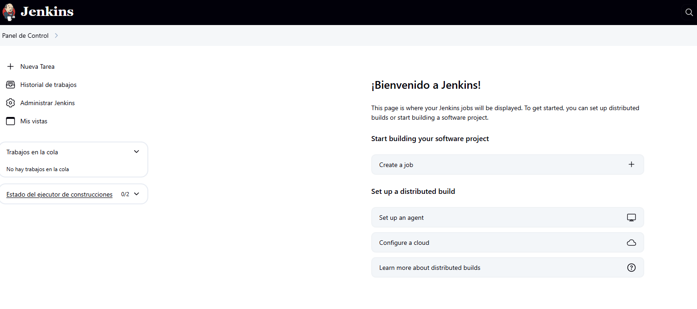
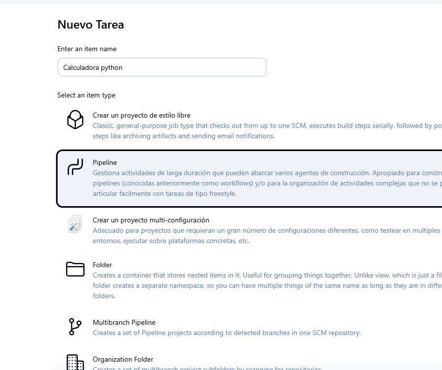
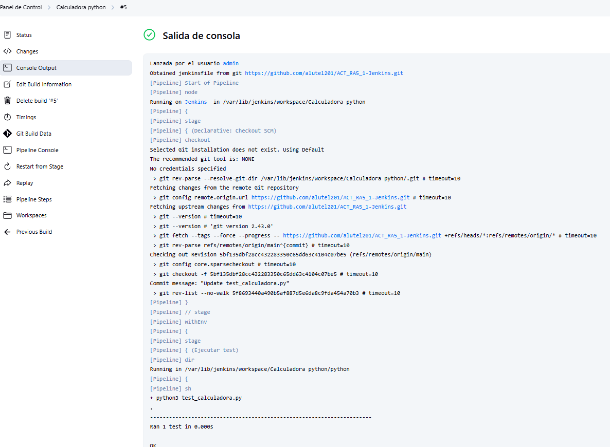
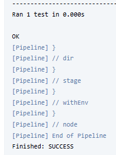
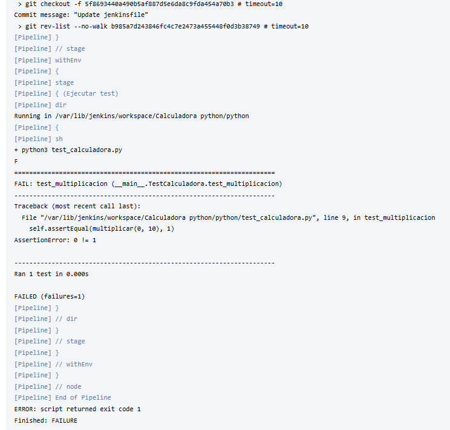

# ACT_RA5_1-Jenkins
ACT_RA5_1 : Jenkins

En este repositorio tengo todo lo que necesito para realizar las tareas de Jenkins

TAREAS 1 Y 2

En esta primera parte tenemos en la carpeta de python dos programas simples que son la calculadora y las pruebas,
en nuestra web jenkins configurando una pipeline tipo git, con la url de este repositorio hacia el jenkins file, 
definiendo el /main y haciendo que se ejecute cada minuto, la pipeline comprobara si se ha realizado algun cambio en el repositorio
debido a lo configurado en el jenkinsfile, de ser asi, ejecutara los programas dentro de la carpeta python, siendo mas especificos,
los test, si los test salen bien, es decir el porgrama va bien, saldra OK, ahora si el programa con los test se modifica y fallan, nos saldra en fallo en jenkins

Esto es lo que saltaria si el test saliera mal.

Ejercicio 3.2

Para este ejericio he necesitado instalar docker con apt, en vez de snap ya que me daba errores, 
y asegurame que tenia instalado lo necesario para que ejecutara los comandos docker compose, y no docker-compose.

He generado un jenkinsfile.docker, que realiza todo esto:

- Ejecuta en un entorno Docker la pipeline
- Crear una imagen de docker
- Ejecuta el docker
- Ejecuta los test en el docker

Para que funione simplemente con tener instalado docker y docker compose, el resto es crear la pipeline igual que la anterior, solo que esta vez en vez de apuntar a el jenkinsfile, apunta a el jenkinsfile.docker.

Este es el log de ejecucion correcto de la pipeline.

Ejecucion final 
Lanzada por el usuario admin 
Obtained Jenkinsfile.docker from git https://github.com/alutel201/ACT_RA5_1-Jenkins.git 
[Pipeline] Start of Pipeline 
[Pipeline] node 
Running on Jenkins  in /var/lib/jenkins/workspace/docker_calculadora 
[Pipeline] { 
[Pipeline] stage 
[Pipeline] { (Declarative: Checkout SCM) 
[Pipeline] checkout 
Selected Git installation does not exist. Using Default 
The recommended git tool is: NONE 
No credentials specified 
 > git rev-parse --resolve-git-dir /var/lib/jenkins/workspace/docker_calculadora/.git # timeout=10 
Fetching changes from the remote Git repository 
 > git config remote.origin.url https://github.com/alutel201/ACT_RA5_1-Jenkins.git # timeout=10 
Fetching upstream changes from https://github.com/alutel201/ACT_RA5_1-Jenkins.git 
 > git --version # timeout=10 
 > git --version # 'git version 2.43.0' 
 > git fetch --tags --force --progress -- https://github.com/alutel201/ACT_RA5_1-Jenkins.git +refs/heads/*:refs/remotes/origin/* # timeout=10 
 > git rev-parse refs/remotes/origin/main^{commit} # timeout=10 
Checking out Revision 45cf0dd477bce85f6d54f055063168d34dc31e0a (refs/remotes/origin/main) 
 > git config core.sparsecheckout # timeout=10 
 > git checkout -f 45cf0dd477bce85f6d54f055063168d34dc31e0a # timeout=10 
Commit message: "Update Jenkinsfile.docker" 
 > git rev-list --no-walk 8ea8e956a3a4fa0fcab6dee11abe31785f4d2356 # timeout=10 
[Pipeline] } 
[Pipeline] // stage 
[Pipeline] withEnv 
[Pipeline] { 
[Pipeline] stage 
[Pipeline] { (Construir imagen Docker) 
[Pipeline] sh 
+ docker build -t calculadora-python . 
DEPRECATED: The legacy builder is deprecated and will be removed in a future release. 
            Install the buildx component to build images with BuildKit: 
            https://docs.docker.com/go/buildx/ 
Sending build context to Docker daemon  165.9kB 
Step 1/5 : FROM python:3.10-slim 
 ---> b32fa0454ca1 
Step 2/5 : WORKDIR /app 
 ---> Using cache 
 ---> 356ccf3bfd56 
Step 3/5 : COPY ./python ./python 
 ---> Using cache 
 ---> 0f389725cb40 
Step 4/5 : WORKDIR /app/python 
 ---> Using cache 
 ---> 800cf5961167 
Step 5/5 : CMD ["python3", "calculadora.py"] 
 ---> Using cache 
 ---> c280af8b4dec 
Successfully built c280af8b4dec 
Successfully tagged calculadora-python:latest 
[Pipeline] } 
[Pipeline] // stage 
[Pipeline] stage 
[Pipeline] { (Ejecutar contenedor) 
[Pipeline] sh 
+ docker run -d --name calculadora_test calculadora-python sleep 5 
ead267bd1338adf8d8842733224ef335a12414921b3de3696732092571cf8911 
[Pipeline] } 
[Pipeline] // stage 
[Pipeline] stage 
[Pipeline] { (Ejecutar tests dentro del contenedor) 
[Pipeline] sh 
+ docker exec calculadora_test python3 /app/python/test_calculadora.py 
. 
---------------------------------------------------------------------- 
Ran 1 test in 0.001s 
 
OK 
[Pipeline] } 
[Pipeline] // stage 
[Pipeline] stage 
[Pipeline] { (Verificar docker-compose) 
[Pipeline] sh 
+ docker compose config 
name: docker_calculadora 
services: 
  calculadora: 
    build: 
      context: /var/lib/jenkins/workspace/docker_calculadora 
      dockerfile: Dockerfile 
    command: 
      - python3 
      - /app/python/calculadora.py 
    container_name: calculadora_compose 
    networks: 
      default: null 
networks: 
  default: 
    name: docker_calculadora_default 
[Pipeline] } 
[Pipeline] // stage 
[Pipeline] stage 
[Pipeline] { (Ejecutar docker-compose) 
[Pipeline] sh 
+ docker compose up -d 
#0 building with "default" instance using docker driver 
#1 [calculadora internal] load build definition from dockerfile 
#1 transferring dockerfile: 153B 0.0s done 
#1 DONE 0.1s 
#2 [calculadora internal] load metadata for docker.io/library/python:3.10-slim 
#2 DONE 0.0s 
#3 [calculadora internal] load .dockerignore 
#3 transferring context: 2B done 
#3 DONE 0.1s 
#4 [calculadora internal] load build context 
#4 transferring context: 1.25kB 0.0s done 
#4 DONE 0.2s 
#5 [calculadora 1/4] FROM docker.io/library/python:3.10-slim 
#5 DONE 0.2s 
#6 [calculadora 2/4] WORKDIR /app 
#6 DONE 1.3s 
#7 [calculadora 3/4] COPY ./python ./python 
#7 DONE 1.9s 
#8 [calculadora 4/4] WORKDIR /app/python 
#8 DONE 1.1s 
#9 [calculadora] exporting to image 
#9 exporting layers 0.1s done 
#9 writing image sha256:9ddf1b3e473d044608ee118f5e64a6ac63bf22ca805647f0850f6a9e821740f6 done 
#9 naming to docker.io/library/docker_calculadora-calculadora 
#9 naming to docker.io/library/docker_calculadora-calculadora done 
#9 DONE 0.1s 
 Network docker_calculadora_default  Creating 
 Network docker_calculadora_default  Created 
 Container calculadora_compose  Creating 
 Container calculadora_compose  Created 
 Container calculadora_compose  Starting 
 Container calculadora_compose  Started 
[Pipeline] } 
[Pipeline] // stage 
[Pipeline] stage 
[Pipeline] { (Declarative: Post Actions) 
[Pipeline] sh 
+ docker rm -f calculadora_test 
calculadora_test 
[Pipeline] sh 
+ docker compose down 
 Container calculadora_compose  Stopping 
 Container calculadora_compose  Stopped 
 Container calculadora_compose  Removing 
 Container calculadora_compose  Removed 
 Network docker_calculadora_default  Removing 
 Network docker_calculadora_default  Removed 
[Pipeline] } 
[Pipeline] // stage 
[Pipeline] } 
[Pipeline] // node 
[Pipeline] End of Pipeline 
Finished: SUCCESS
